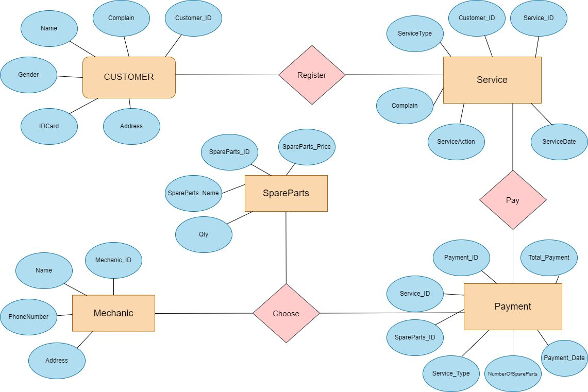

# Service Mobil

## Manfaat Menggunakan Database Service Mobil

***Menggunakan database service mobil dapat memberikan beberapa manfaat bagi bisnis bengkel mobil, antara lain*** 

- Hemat waktu dalam mengelola operasi penjualan, mencatat historis pelanggan, memperkirakan pembelian suku cadang, mengelola persediaan, hingga bagian keuangan dan akuntansi

- Mengukur kinerja bisnis dengan lebih mudah dan akurat.

- Mengelola data dengan mudah dan efisien, karena semua data tersimpan di cloud sehingga tidak perlu lagi ruang penyimpanan file arsip.

- Memberikan layanan terbaik kepada pelanggan dengan mudah diakses secara mobile.

- Mempermudah bengkel dalam menjalankan pekerjaannya.

- Membuat report data kendaraan dan riwayat servis mobil.

- Pelanggan dapat menambahkan antrian pelayanan service dengan mengisikan data pada halaman Tambah Antrian.

- Pelanggan dapat mengetahui waktu pengerjaan motor dan riwayat servis mobil.

- Meningkatkan kualitas pelayanan pelanggan.

Dengan menggunakan database service mobil, bisnis bengkel mobil dapat meningkatkan efisiensi dan efektivitas operasionalnya, serta memberikan layanan terbaik kepada pelanggan.

## SELESAI  

